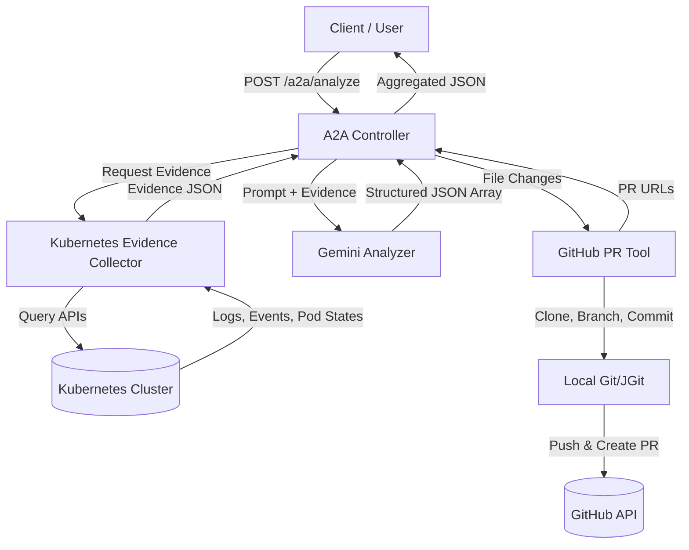

# Kubernetes AI Agent

## 1. Overview
The **Kubernetes AI Agent** is an autonomous troubleshooting and remediation engine designed to diagnose failing workloads within a Kubernetes cluster. 

Kubernetes troubleshooting is notoriously difficult because evidence is highly distributed. When a deployment fails, diagnosing the root cause requires correlating pod statuses, container exit codes, termination reasons, raw logs, and cluster events. 

This project automates the diagnosis process. The current Mid-Term MVP automatically discovers all unhealthy workloads in a cluster, deterministically collects all relevant evidence, and submits it to a large language model (Gemini or Gemma) in a single shot. The AI reasons about the failure and generates a structured diagnosis. If requested, the system automatically translates this diagnosis into a concrete file change and opens a remediation Pull Request on GitHub.

## 2. Key Features
*   **Autonomous Workload Discovery**: Automatically finds failing pods and deployments (e.g., `CrashLoopBackOff`, `ImagePullBackOff`, `OOMKilled`).
*   **Deterministic Evidence Collection**: Gathers pod states, container exit codes, restart counts, logs, and Kubernetes events without relying on unreliable AI tool loops.
*   **Single-Shot AI Analysis**: Uses Gemini (or any OpenAI-compatible endpoint like vLLM/Gemma) to analyze the evidence in one robust API call.
*   **Structured Diagnosis**: Returns highly structured, typed JSON containing root cause, confidence scores, and specific file modifications.
*   **Automated GitHub Remediation**: Deterministically clones a configured repository, applies AI-suggested manifest fixes, and opens a GitHub Pull Request to remediate the cluster issue.
*   **A2A (Agent-to-Agent) API**: Provides a clean `/a2a/analyze` REST endpoint for external clients or upstream agents to trigger full investigations.

## 3. Architecture Overview


## 4. Technology Stack
*   **Language**: Java 17+
*   **Framework**: Spring Boot 4.x
*   **AI SDK**: Google ADK (Agent Development Kit)
*   **Models**: Gemini (`gemini-3-flash-preview`) or Gemma (via vLLM)
*   **Kubernetes Client**: Fabric8 Kubernetes Client
*   **Git Integration**: Eclipse JGit & GitHub API (Kohsuke)
*   **Build Tool**: Maven

## 5. Project Structure
```text
src/
 └── main/
     └── java/
         └── org/csanchez/adk/agents/k8sagent/
             ├── a2a/
             │   ├── A2AController.java             # Main REST API entrypoint
             │   ├── GeminiAnalyzer.java            # AI prompt generation and JSON parsing
             │   ├── KubernetesEvidenceCollector.java # Deterministic cluster querying
             │   ├── WorkloadRemediation.java       # DTO for individual workload fixes
             │   └── GlobalExceptionHandler.java    # Error handling
             ├── remediation/
             │   ├── GitHubPRTool.java              # Orchestrates PR creation
             │   └── GitOperations.java             # Pure Java/JGit file modifications
             ├── models/
             │   └── VllmGemma.java                 # Integration for open-weights Gemma models
             ├── tools/                             # (Legacy/Obsolete) Old ADK tools
             └── config/                            # Environment configuration loader
```

## 6. How the System Works
1.  **Request**: A user or upstream agent sends a POST request to `/a2a/analyze`.
2.  **Discovery**: The `A2AController` invokes the `KubernetesEvidenceCollector`.
3.  **Collection**: The collector directly queries the Kubernetes API for unhealthy pods, gathering logs, events, exit codes, and container states into a tight JSON string.
4.  **Analysis**: The `GeminiAnalyzer` constructs a strict prompt containing the deterministic evidence and sends it to the configured LLM.
5.  **Parsing**: The LLM returns a structured JSON array representing multiple workload diagnoses, which Jackson deserializes into Java DTOs.
6.  **Remediation**: If the request context asks for a PR, the `GitHubPRTool` applies the exact file changes to a cloned repo and pushes a PR.
7.  **Response**: The controller wraps the results in a clean JSON object containing success metrics, workload analyses, and the generated PR URLs.

## 7. Installation / Setup
### Prerequisites
*   Java 17+
*   Maven
*   An active Kubernetes cluster (`~/.kube/config` must be valid)
*   GitHub Personal Access Token (with repo access)
*   Gemini API Key (or a running vLLM server)

### Configuration
Create a `.env` file in the project root:
```env
# AI Configuration
LLM_PROVIDER=gemini
MODEL_NAME=gemini-3-flash-preview
GOOGLE_API_KEY=your_gemini_api_key

# GitHub Remediation Configuration
GITHUB_TOKEN=your_github_pat
GITHUB_REPO_URL=https://github.com/your-username/your-repo.git
GIT_USERNAME=Your Name
GIT_EMAIL=your.email@example.com
```

## 8. Running the Project
1.  **Build the project**:
    ```bash
    mvn -DskipTests clean package
    ```
2.  **Run the application**:
    ```bash
    java -jar target/kubernetes-agent-1.0.0-SNAPSHOT.jar
    ```
The server will start on port `8080`. It will automatically use your local active Kubernetes context (`kubectl config current-context`).

## 9. API Usage
### Analyze Unhealthy Workloads
*   **Method**: `POST`
*   **URL**: `http://localhost:8080/a2a/analyze`
*   **Purpose**: Discover unhealthy workloads, diagnose them, and optionally create PRs.

**Request Body**:
```json
{
  "userId": "test-user",
  "prompt": "Investigate all unhealthy workloads in my Kubernetes cluster and create a separate GitHub Pull Request to remediate each.",
  "context": {}
}
```

**Example cURL**:
```bash
curl -X POST http://localhost:8080/a2a/analyze \
  -H "Content-Type: application/json" \
  -d '{"userId":"test","prompt":"Investigate and remediate","context":{}}'
```

## 10. Example Output
```json
{
  "success": true,
  "workloadCount": 1,
  "pullRequestCount": 1,
  "workloads": [
    {
      "affectedWorkload": "crashloop-test",
      "namespace": "default",
      "failureType": "CrashLoopBackOff",
      "confidence": 100,
      "evidence": "Pod state is CrashLoopBackOff with exitCode 1. Logs show: 'Simulated failure'.",
      "rootCause": "The container exits immediately due to intentional failing command.",
      "remediation": "Replace failing command with a sleep command.",
      "fileChanges": {
        "deployment.yaml": "spec:\n  template:\n..."
      },
      "requiresGitHubPR": true,
      "prLink": "https://github.com/Saksham-kotia/kubernetes-agent-test/pull/22"
    }
  ]
}
```

## 11. Current MVP Scope
**Implemented:**
*   Automatic detection of standard failure states (`CrashLoopBackOff`, `ImagePullBackOff`, `OOMKilled`, `Error`).
*   One-shot Gemini analysis of deterministically gathered evidence.
*   Simultaneous multi-workload diagnosis and PR creation.
*   Automatic GitHub branching, committing, and PR generation.

**Intentionally Not Implemented / Limitations:**
*   Direct cluster modification (the agent is explicitly read-only against the cluster; it remediates via GitOps PRs).
*   Deep cluster-wide networking or RBAC debugging.
*   Analyzing workloads that appear "healthy" to Kubernetes but are failing functional checks.

## 12. Future Roadmap
*   **Automated Remediation**: Add support for direct cluster patching if the user opts out of GitOps.
*   **Alert Integration**: Trigger investigations automatically via webhooks from Prometheus/Alertmanager.
*   **Historical Incident Knowledge**: Store past diagnoses in a vector DB to prevent the LLM from making the same mistakes twice.

## 13. Development Notes
*   **Legacy ADK Tools**: The `src/main/java/org/csanchez/adk/agents/k8sagent/tools/` directory contains legacy Google ADK tools. These were used in earlier versions of the agent but are **bypassed** in the current `/a2a/analyze` workflow in favor of the much faster, deterministic `KubernetesEvidenceCollector`.
*   **Model Switching**: You can switch to open-source models by changing `LLM_PROVIDER=openai-compatible` and providing a `LLM_BASE_URL` pointing to a vLLM server.
