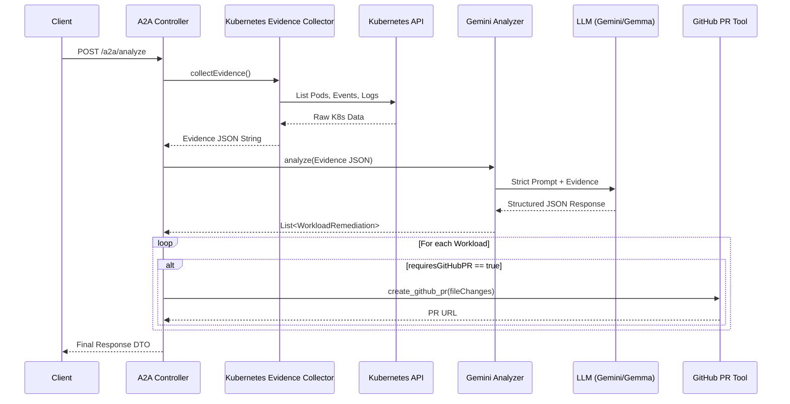

# Project Architecture & Workflow

## 1. Purpose of This Document
This document provides a detailed technical explanation of the current Mid-Term MVP architecture, execution flow, components, responsibilities, and design decisions for the Kubernetes AI Agent. It is designed to help new developers understand exactly how the project currently functions, distinguishing between active components and legacy/obsolete components from earlier iterations of the project.

---

## 2. System Overview
The Kubernetes AI Agent operates as a Spring Boot web application exposing a REST API for autonomous cluster troubleshooting.

The core architecture is a **one-shot deterministic data collection and AI analysis pipeline**. Rather than giving an AI agent free reign to execute arbitrary Kubernetes commands in a loop, the system deterministically gathers all necessary evidence first, and then submits a single, highly structured prompt to the LLM (Gemini or Gemma) for diagnosis and remediation.

```mermaid
flowchart TD
    Client[Client / Caller] -->|POST /a2a/analyze| Controller[A2A Controller]
    
    subgraph Spring Boot Backend
        Controller -->|collectEvidence()| Collector[Kubernetes Evidence Collector]
        Controller -->|analyze()| Analyzer[Gemini Analyzer]
        Controller -->|create_github_pr()| PRTool[GitHub PR Tool]
    end
    
    subgraph External Systems
        Collector -->|Queries API| K8s[(Kubernetes Cluster)]
        Analyzer -->|Prompt + Evidence| LLM[Google Gemini / vLLM]
        PRTool -->|GitOps| GitHub[(GitHub)]
    end
```

---

## 3. Complete Request Lifecycle
When a request is submitted to investigate the cluster, the following exact sequence occurs:

1.  **Entry Point:** The request enters via `POST /a2a/analyze`.
2.  **Controller Routing:** The `A2AController.analyze(A2ARequest)` method receives the request.
3.  **Evidence Collection:** `A2AController` calls `KubernetesEvidenceCollector.collectEvidence(targetNamespace)`.
4.  **Cluster Interrogation:** The collector queries the Fabric8 Kubernetes client to discover unhealthy pods (e.g., pods not in `Running` or `Succeeded` state, or with container restarts > 0).
5.  **Evidence Aggregation:** For each unhealthy pod, the collector fetches the pod state, container state (including `waiting` and `terminated` reasons and exit codes), recent logs, and namespace events. This is formatted into a dense JSON string.
6.  **AI Invocation:** `A2AController` passes the evidence and user prompt to `GeminiAnalyzer.analyze()`.
7.  **Prompt Construction:** `GeminiAnalyzer` wraps the evidence in a strict system prompt demanding a structured JSON array of diagnoses.
8.  **Model Execution:** `GeminiAnalyzer` delegates the call to the underlying `BaseLlm` implementation (e.g., Gemini API or OpenAI-compatible Gemma).
9.  **Parsing:** `GeminiAnalyzer` strips Markdown formatting from the response and uses Jackson to deserialize the string into a `List<WorkloadRemediation>`.
10. **Remediation Loop:** Back in `A2AController`, the code iterates over the `WorkloadRemediation` list.
11. **GitHub PR Creation:** If a workload requires a PR (`requiresGitHubPR == true`) and has file changes, `A2AController` invokes `GitHubPRTool.create_github_pr(...)`.
12. **Response Construction:** `A2AController` packages the `success` status, workload list, and PR URLs into a final `Map<String, Object>` response DTO.
13. **Return:** The client receives the structured JSON response.

---

## 4. Component-by-Component Architecture

### 4.1 A2A Controller (`A2AController.java`)
*   **Responsibility:** Orchestrating the request lifecycle, delegating tasks to specific services, and formatting the final JSON output.
*   **Endpoints:** `/a2a/analyze`
*   **Exception Handling:** Catches broad exceptions and relies on `GlobalExceptionHandler` to format standard error DTOs.

### 4.2 Kubernetes Evidence Collector (`KubernetesEvidenceCollector.java`)
*   **Responsibility:** Interfacing with the Kubernetes API to find problems without AI intervention.
*   **How it works:** Iterates through Pods. If a Pod is failing or crashing, it extracts deeply nested status details (`containerStatuses[].state`, `lastState`, `restartCount`) and fetches the last 50 lines of logs and relevant events.

### 4.3 Gemini Analyzer (`GeminiAnalyzer.java`)
*   **Responsibility:** Interfacing with the LLM.
*   **Prompt Construction:** Merges user requests with a hardcoded strict instruction set that forces the LLM to output a precise JSON schema, handling `CrashLoopBackOff` and `OOMKilled` explicitly.
*   **Parsing:** Extracts the JSON payload and uses Jackson Object Mapper to hydrate Java DTOs.

### 4.4 Kubernetes Agent (`KubernetesAgent.java` - Legacy/Fallback)
*   **Active in MVP?** No (for the A2A API), but it is still the core bootstrap class for the general web chat UI.
*   **Role:** Registers LLMs in the `LlmRegistry` and binds legacy tools.

### 4.5 K8s Tools (Legacy AI Tools)
Earlier versions of this project allowed the AI to recursively call tools. This proved slow and quota-heavy, leading to the current deterministic architecture.

| Tool | Active? | Used By | Purpose | Current MVP? |
| :--- | :---: | :--- | :--- | :---: |
| `K8sDebugTool.java` | ❌ No | `KubernetesAgent` | Generic cluster debugging | ❌ No |
| `K8sEventsTool.java` | ❌ No | `KubernetesAgent` | Fetching K8s events | ❌ No |
| `K8sLogsTool.java` | ❌ No | `KubernetesAgent` | Fetching K8s logs | ❌ No |
| `K8sMetricsTool.java`| ❌ No | `KubernetesAgent` | Fetching metrics server data| ❌ No |
| `K8sResourcesTool.java`|❌ No| `KubernetesAgent` | Fetching YAML resources | ❌ No |
| `K8sTools.java` | ❌ No | `KubernetesAgent` | Base tool abstraction | ❌ No |

### 4.6 A2A Models / DTOs
*   **`A2ARequest.java`**: Maps the incoming POST request (`userId`, `prompt`, `modelsToUse`, `context`).
*   **`WorkloadRemediation.java`**: The core data object containing the LLM's diagnosis (`affectedWorkload`, `failureType`, `rootCause`, `evidence`, `remediation`, `fileChanges`, `prLink`).

### 4.7 GitHub PR Integration
*   **`GitHubPRTool.java`**: Fully active. Takes a repository URL and a map of file modifications.
*   **`GitOperations.java`**: Fully active. A pure Java abstraction over Eclipse JGit for deterministic cloning, branching, committing, and pushing.

---

## 5. Kubernetes Evidence Collection
The collection subsystem uses `Fabric8` to deterministically aggregate evidence before the AI sees it.

```mermaid
flowchart TD
    Start[Target Namespace] --> ListPods[List All Pods]
    ListPods --> Filter{Is Pod Unhealthy?}
    Filter -->|No| Skip[Ignore]
    Filter -->|Yes| Collect[Collect Evidence]
    
    Collect --> Status[Pod Status & Phase]
    Collect --> CState[Container State / Exit Code]
    Collect --> PState[Previous State (e.g. OOMKilled)]
    Collect --> Restarts[Restart Count]
    Collect --> Events[Fetch Warning Events]
    Collect --> Logs[Fetch Last 50 Lines of Logs]
    
    Status & CState & PState & Restarts & Events & Logs --> BuildJSON[Format as JSON String]
```

---

## 6. Diagnosis / AI Analysis Workflow
The current system relies on a **SINGLE** Gemini call to conserve API quota and reduce latency. 

1.  `GeminiAnalyzer` injects the JSON string from the Evidence Collector into the prompt.
2.  The prompt explicitly instructs the LLM not to invent configurations or request more tools.
3.  The LLM generates a text response containing a JSON block.
4.  The system parses this JSON into a `List<WorkloadRemediation>`.

---

## 7. Current Architecture vs Previous Architecture

### Deprecated Previous Architecture (Multi-Tool Loop)
Previously, the agent used a recursive ReAct loop:
```text
Request -> Agent -> LLM Loop (Uses K8sLogsTool, K8sEventsTool) -> VotingAggregator -> Response
```
*   **Status:** Abandoned due to high API quota usage and latency. 
*   **Orphaned Files:** `VotingAggregator.java`, `ExecutionMetrics.java`, `ModelAnalysisResult.java` (partially).

### Current Architecture (Deterministic One-Shot)
```text
Request -> Evidence Collector -> Single LLM Call -> Structured Output -> GitHub PR -> Response
```

---

## 8. Data Flow



---

## 9. Error Handling
*   **Global Exception Handling:** `GlobalExceptionHandler.java` intercepts unhandled exceptions and returns a `500 Internal Server Error` with a gracefully formatted `WorkloadRemediation` object indicating a System Error.
*   **LLM Parsing Failures:** If the LLM returns invalid JSON, Jackson throws a mapping exception which is caught and returned as an API error.
*   **Git Failures:** If JGit fails to clone or push (e.g., bad credentials), `GitHubPRTool` catches the exception and populates the `prLink` field with the error message rather than crashing the request.

---

## 10. Configuration
The application relies on a `.env` file or environment variables.

| Variable | Purpose | Required? | Example |
| :--- | :--- | :---: | :--- |
| `GOOGLE_API_KEY` | Authenticates with Gemini API | Yes (if using Gemini) | `AIzaSy...` |
| `LLM_PROVIDER` | Determines which model class to load (`gemini` or `openai-compatible`) | No (Defaults to `gemini`) | `gemini` |
| `MODEL_NAME` | The specific model identifier | Yes | `gemini-3-flash-preview` |
| `VLLM_API_BASE` | URL for open-weights models | Yes (if using Gemma) | `http://vllm:8000/v1` |
| `GITHUB_TOKEN` | Auth token for creating PRs | Yes (for Remediation) | `ghp_...` |
| `GITHUB_REPO_URL`| Target repository to fix | Yes (for Remediation) | `https://github.com/user/repo.git` |
| `GIT_USERNAME` | Git commit username | No | `Agent` |
| `GIT_EMAIL` | Git commit email | No | `agent@k8s.local` |

---

## 11. Security Considerations
*   **Read-Only Cluster Access:** The `KubernetesEvidenceCollector` strictly reads data. The agent is not authorized to directly mutate the cluster, eliminating the risk of rogue AI destructive actions. Remediation happens safely via GitOps PRs.
*   **Secrets Management:** API keys (`GOOGLE_API_KEY`, `GITHUB_TOKEN`) must never be committed to source control and are loaded exclusively at runtime via `.env` or system environment variables.

---

## 12. Deployment Architecture
*   **Agent Deployment:** The agent itself is packaged as a standard executable Spring Boot JAR. It can be containerized using the provided `Dockerfile` and deployed to Kubernetes using the manifests in `deployment/`.
*   **Local LLM Deployment (Optional/Legacy):** The repository contains a `deployment/gemma/` folder with YAML files for deploying self-hosted Gemma models via vLLM. This is entirely optional and only relevant if avoiding cloud APIs.

---

## 13. Testing
*   **Test Scripts:** The root directory contains legacy bash scripts (`test-multi-model.sh`, `test-models.sh`, `test-agent.sh`) used for early prototyping. 
*   **Integration Tests:** Integration testing against the Gemini API has been heavily minimized to conserve API quota. Verification of JSON serialization and controller logic is typically handled via static inspection or mocked unit tests rather than live API calls.

---

## 14. Known Limitations
*   **Blind to "Healthy" Failures:** The current MVP relies on Kubernetes signaling a failure (e.g., `CrashLoopBackOff`, non-zero exit codes). It cannot diagnose applications that are running fine from a K8s perspective but returning `HTTP 500` internally unless a readiness probe is explicitly failing.
*   **Strict JSON Requirement:** The prompt forces the LLM to return valid JSON. If a weaker model is used (like Gemma 1B), it may generate invalid JSON, causing parsing errors.

---

## 15. Future Architecture
*   **Automated Remediation / Direct Patching:** Permitting the agent to optionally apply patches directly to the cluster (bypassing Git) for critical break-glass scenarios.
*   **Alert Integration:** Listening directly to Prometheus Alertmanager webhooks to trigger investigations autonomously before a human even logs in.

---

## 16. File-Level Architecture Map

| File | Responsibility | Active in MVP? | Depends On |
| :--- | :--- | :---: | :--- |
| `A2AController.java` | API endpoint orchestration | ✅ Yes | `KubernetesEvidenceCollector`, `GeminiAnalyzer`, `GitHubPRTool` |
| `KubernetesEvidenceCollector.java` | Cluster interrogation | ✅ Yes | Fabric8 Client |
| `GeminiAnalyzer.java` | LLM invocation & parsing | ✅ Yes | `LlmRegistry`, Jackson |
| `GitHubPRTool.java` | GitOps remediation workflow | ✅ Yes | `GitOperations`, Kohsuke GitHub |
| `GitOperations.java` | Pure JGit operations | ✅ Yes | Eclipse JGit |
| `WorkloadRemediation.java` | Data Transfer Object | ✅ Yes | - |
| `A2AResponse.java` | JSON Deserialization object | ✅ Yes (Internal) | - |
| `KubernetesAgent.java` | Base ADK setup / Generic chat UI | ⚠️ Partial | `LlmRegistry`, `K8sTools` |
| `K8s*Tool.java` (6 files) | Legacy ADK Tool Calling | ❌ No | - |
| `VotingAggregator.java` | Multi-model vote tallying | ❌ No | - |
| `ExecutionMetrics.java` | Legacy metric tracking | ❌ No | - |
| `RetryHelper.java` | Execution wrapper | ❌ No | - |

---

## 17. Glossary
*   **A2A (Agent-to-Agent):** Refers to the headless REST API (`/a2a/analyze`) designed for programmatic interaction rather than human web-chat.
*   **Evidence Collector:** The deterministic Java code that queries Kubernetes for logs/events *before* talking to the AI.
*   **Workload:** A Kubernetes Deployment, Pod, or similar compute abstraction.
*   **GitOps:** The pattern of making cluster changes by opening Pull Requests against infrastructure-as-code repositories, which this agent utilizes for safe remediation.
